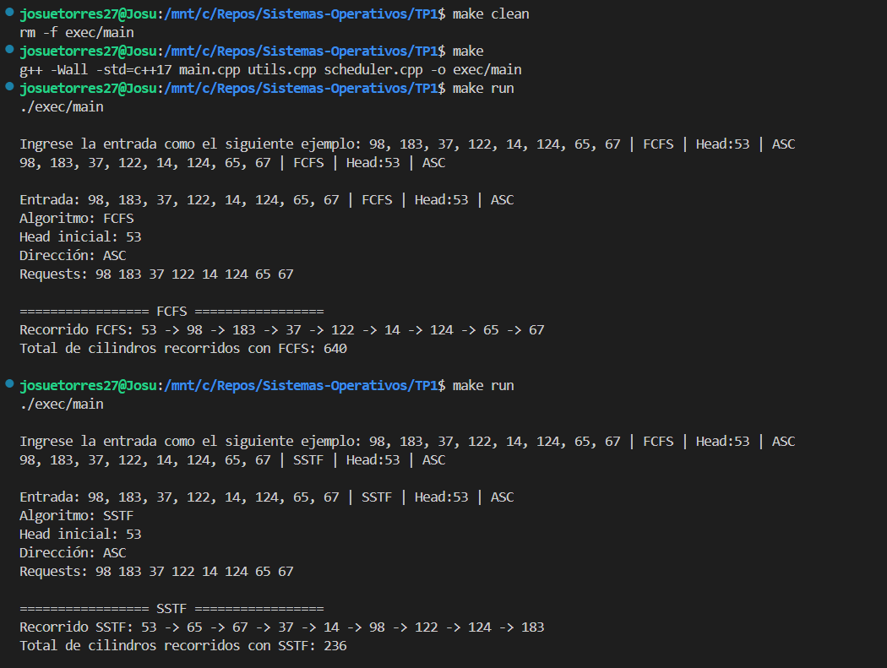
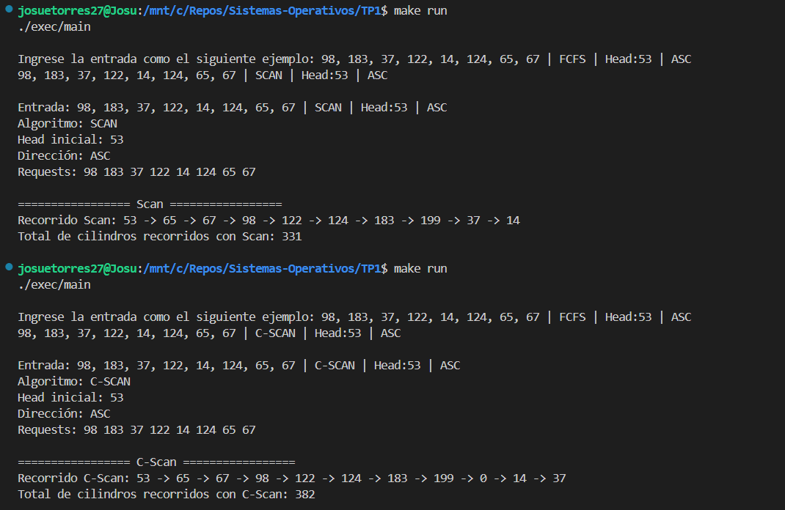
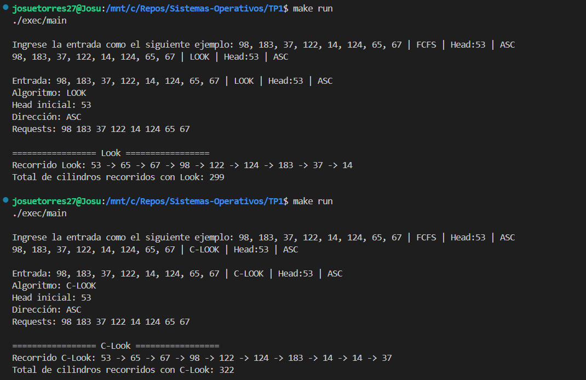
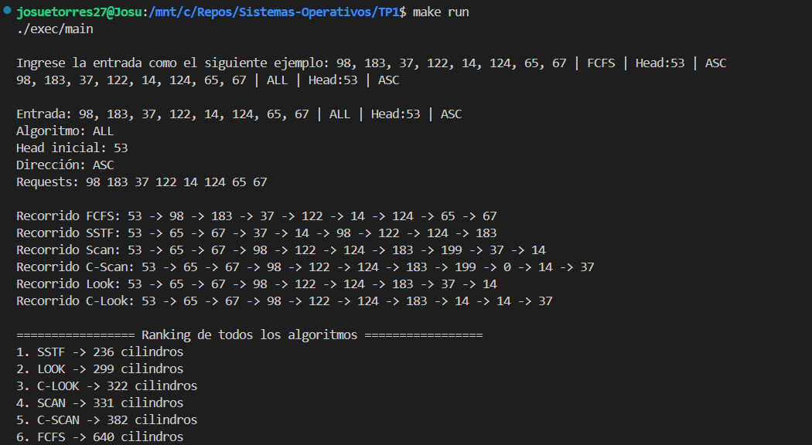
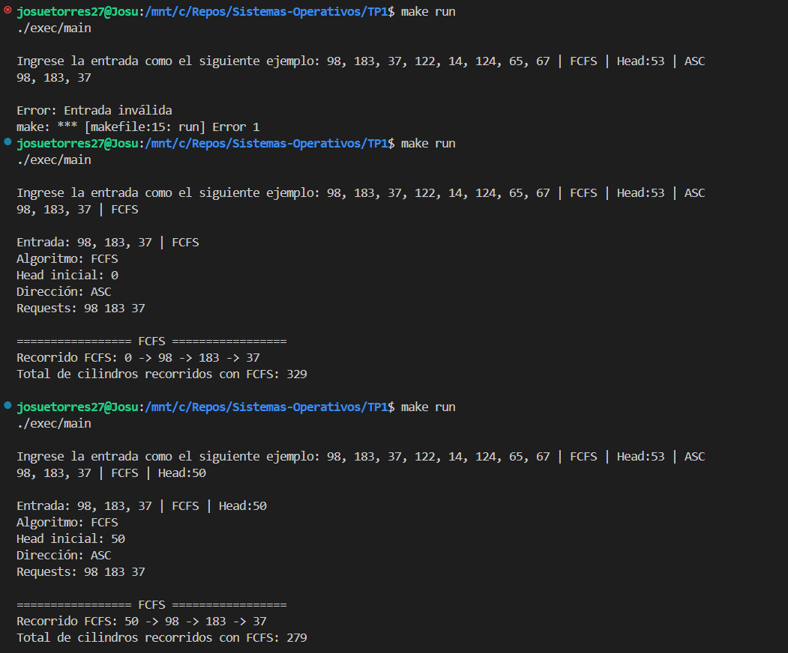
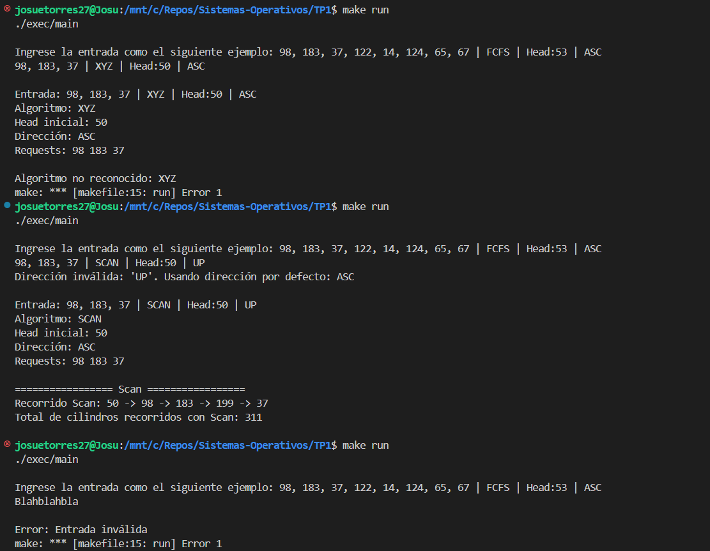

# Integrantes
- ### José Guerra Rodríguez C33510
- ### Josué Torres Sibaja C37853

# Visión General del Funcionamiento del Programa
Este programa simula el comportamiento de diferentes algoritmos de planificación de discos, utilizando como entrada una lista de peticiones de cilindros y otros parámetros que definen cómo debe operar el algoritmo. El objetivo principal es calcular y mostrar el recorrido total de cilindros que realiza la cabeza del disco al atender las solicitudes, según el algoritmo seleccionado.  
El programa utiliza la versión estándar de C++17, y solo requiere el compilador g++, que ya viene instalado por defecto en muchas distribuciones como Ubuntu o Fedora, o puede instalarse fácilmente desde los repositorios oficiales.

### Estructura de la Entrada
La entrada del usuario debe seguir el siguiente formato:

    [requests] | [algoritmo] | [head] | [dirección]

- requests: Lista de números de cilindros separados por comas. Ejemplo: 98, 183, 37, 122.
- algoritmo: Algoritmo a utilizar. Puede ser uno de los siguientes: FCFS, SSTF, SCAN, C-SCAN, LOOK, C-LOOK, o ALL (ejecuta todos los anteriores).
- head (opcional): Posición inicial de la cabeza, en el formato Head:<número>. Por defecto es 0 si no se especifica.
- dirección (opcional): Dirección de inicio del movimiento para algoritmos que lo requieren (SCAN, C-SCAN, LOOK, C-LOOK). Puede ser ASC (ascendente) o DESC (descendente). Por defecto es ASC.

### Proceso Interno
Lectura y validación de la entrada:
- Se separa la cadena ingresada por el carácter |.
- Se parsean las peticiones (requests), la posición inicial de la cabeza (head) y la dirección (ASC o DESC).
- Se valida la estructura de la entrada y los datos ingresados.

### Ejecución del algoritmo
- Según el nombre del algoritmo ingresado, se invoca la función correspondiente.
- Se calcula el total de cilindros recorridos por la cabeza del disco.
- Se imprime el recorrido de la cabeza y el total de cilindros recorridos.

### Modo Ranking (ALL)
- Si el usuario especifica el algoritmo como ALL, se ejecutan todos los algoritmos disponibles.
- Se registra el número de cilindros recorridos por cada uno.
- Se ordenan de menor a mayor recorrido y se presenta un ranking.

### Salidas del Programa
- La ruta seguida por la cabeza (p. ej., 53 -> 65 -> 67 -> 37).
- El total de cilindros recorridos.
- En el modo ALL, se imprime un ranking comparativo entre los algoritmos.

# Compilar y Ejecutar el Programa
Para compilar y correr el programa se deben ejecutar los siguientes comandos:

    make clean
    make
    make run

Cuando el programa se ejecute, solicitará la entrada para realizar la simulación. En la siguiente sección se proveen distintos casos de prueba válidos, incompletos e inválidos para probar el programa.  
Se debe copiar el texto dentro de la columna "Entrada" de cada tabla (quitando los `\` en caso de estar viendo el README puro) y pegarlo cuando el programa solicite la entrada.  
El programa debe devolver el resultado esperado según el caso de prueba.

# Casos de Prueba

### Casos Válidos por Algoritmo
| Caso | Entrada | Resultado esperado |
| --- | --- | --- |
| FCFS | 98, 183, 37, 122, 14, 124, 65, 67 \| FCFS \| Head:53 \| ASC | Total de cilindros recorridos con FCFS: 640 |
| SSTF | 98, 183, 37, 122, 14, 124, 65, 67 \| SSTF \| Head:53 \| ASC | Total de cilindros recorridos con SSTF: 236 |
| SCAN (ASC) | 98, 183, 37, 122, 14, 124, 65, 67 \| SCAN \| Head:53 \| ASC | Total de cilindros recorridos con Scan: 331 |
| SCAN (DESC) | 98, 183, 37, 122, 14, 124, 65, 67 \| SCAN \| Head:53 \| DESC | Total de cilindros recorridos con Scan: 236 |
| C-SCAN (ASC) | 98, 183, 37, 122, 14, 124, 65, 67 \| C-SCAN \| Head:53 \| ASC | Total de cilindros recorridos con C-Scan: 382 |
| C-SCAN (DESC) | 98, 183, 37, 122, 14, 124, 65, 67 \| C-SCAN \| Head:53 \| DESC | Total de cilindros recorridos con C-Scan: 386 |
| LOOK (ASC) | 98, 183, 37, 122, 14, 124, 65, 67 \| LOOK \| Head:53 \| ASC | Total de cilindros recorridos con Look: 299 |
| LOOK (DESC) | 98, 183, 37, 122, 14, 124, 65, 67 \| LOOK \| Head:53 \| DESC | Total de cilindros recorridos con Look: 208 |
| C-LOOK (ASC) | 98, 183, 37, 122, 14, 124, 65, 67 \| C-LOOK \| Head:53 \| ASC | Total de cilindros recorridos con C-Look: 322 |
| C-LOOK (DESC) | 98, 183, 37, 122, 14, 124, 65, 67 \| C-LOOK \| Head:53 \| DESC | Total de cilindros recorridos con C-Look: 326 |
| ALL (Ranking) | 98, 183, 37, 122, 14, 124, 65, 67 \| ALL \| Head:53 \| ASC | ---> |
| ALL (Ranking) | 98, 183, 37, 122, 14, 124, 65, 67 \| ALL \| Head:53 \| DESC | ---> |
Ranking esperado (ASC):
1. SSTF -> 236 cilindros
2. LOOK -> 299 cilindros
3. C-LOOK -> 322 cilindros
4. SCAN -> 331 cilindros
5. C-SCAN -> 382 cilindros
6. FCFS -> 640 cilindros

Ranking esperado (DESC):
1. LOOK -> 208 cilindros
2. SCAN -> 236 cilindros
3. SSTF -> 236 cilindros
4. C-LOOK -> 326 cilindros
5. C-SCAN -> 386 cilindros
6. FCFS -> 640 cilindros

### Casos de Entradas Incompletas / Parciales
| Caso | Entrada | Resultado esperado |
| --- | --- | --- |
| Menos de 2 argumentos | 98, 183, 37 | Error: Entrada inválida |
| Solo requests + algoritmo | 98, 183, 37 \| FCFS | Total de cilindros recorridos con FCFS: 329 (Ejecuta con Head = 0 y Dirección = ASC) |
| Tres argumentos (sin dirección) |	98, 183, 37 \| FCFS \| Head:50 | Total de cilindros recorridos con FCFS: 279 (Ejecuta con Dirección = ASC) |
| Cuatro argumentos válidos | 98, 183, 37 \| FCFS \| Head:50 \| ASC | Total de cilindros recorridos con FCFS: 279 (Información completa) |

### Casos Inválidos
| Caso | Entrada | Resultado esperado |
| --- | --- | --- |
| Algoritmo no válido | 98, 183, 37 \| XYZ \| Head:50 \| ASC | Algoritmo no reconocido: XYZ |
| Dirección inválida | 98, 183, 37 \| SCAN \| Head:50 \| UP | Dirección inválida: 'UP'. Usando dirección por defecto: ASC |
| Entrada sin estructura | Blahblahbla | Error: Entrada inválida |

# Imágenes de Resultados
A continuación se muestran los resultados esperados del programa al ejecutar los casos de prueba en Ubuntu, con Dirección = ASC.

### Algoritmos

### Entradas Incompletas

### Entradas Inválidas
