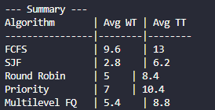

# Tarea Programada III: Algoritmos de Planificación de Procesos

## Integrantes

- **José Guerra Rodríguez** - C33510  

- **Josué Torres Sibaja** - C37853

---

## Visión General del Proyecto

Este programa permite simular y comparar distintos algoritmos de planificación de procesos, mostrando métricas relevantes como:

- **Throughput**
- **Tiempo de espera (Waiting Time)**
- **Tiempo de retorno (Turnaround Time)**

El usuario puede seleccionar entre varios algoritmos o ejecutar todos para una comparación directa.

---

## Algoritmos Implementados

- **First Come First Served (FCFS)**
- **Shortest Job First (SJF)**
- **Round Robin (Q = 2)**
- **Priority Scheduling**
- **all** – ejecuta y compara todos los algoritmos anteriores

---

## Requisitos

- Sistema operativo: Ubuntu o Fedora
- Compilador: `g++` con soporte para C++17

### Instalación del compilador

**Ubuntu/Debian:**

```bash
sudo apt update
sudo apt install g++
```

**Fedora:**

```bash
sudo dnf install gcc-c++
```

---

## Compilación y Ejecución

### Compilar

```bash
make clean
make
```

### Ejecutar

```bash
make run
```

---

## Formato de Entrada

Al ejecutar el programa, se solicita una línea de entrada con el siguiente formato:

```
n | burst_times | priorities | arrivals | algorithm
```

### Detalles

- `n`: Número total de procesos
- `burst_times`: Tiempos de CPU (por ejemplo `10,1,2,1,3`)
- `priorities`: Números de prioridad (0 si no aplica)
- `arrivals`: Tiempos de llegada (0 si todos llegan al tiempo 0)
- `algorithm`: Nombre del algoritmo (`FCFS`, `SJF`, `RR`, `Priority`, `MLFQ`, `all`)

> **Ejemplo:**

```
5 | 10,1,2,1,3 | 3,1,4,5,2 | 0 | Priority
```

---

## Salida Esperada

El programa imprime por consola para cada proceso:

- Tiempo de inicio y finalización
- Tiempo de espera
- Tiempo de retorno

Y al final:

- **Promedio de tiempos de espera y retorno**
- **Throughput**
- En modo `all`, se muestra un resumen comparativo por algoritmo.

---

## Algoritmo Multilevel Feedback Queue (MLFQ)

### ¿Qué es MLFQ?

MLFQ es un algoritmo de planificación que simula múltiples niveles de prioridad, en donde cada cola puede tener su propio algoritmo. Los procesos pueden ser "degradados" a niveles inferiores si consumen mucho CPU sin terminar, lo que da preferencia a procesos más cortos o interactivos.

### Estructura usada en esta implementación

- **Nivel 0**: Round Robin con `quantum = 2`
- **Nivel 1**: Round Robin con `quantum = 4`
- **Nivel 2**: FCFS

Todos los procesos ingresan inicialmente a la cola de mayor prioridad (nivel 0). Si no terminan dentro de su quantum, bajan al siguiente nivel.

### ¿Por qué no hay mejora de nivel?

Porque el enunciado solo exige implementar uno de los dos y **definir** el otro. En este caso, los procesos **no suben de nivel**. Se podría definir que para que suba de nivel un sistema externo, se reordenaría las colas tras cierto tiempo (por ejemplo, usando técnicas de envejecimiento o repriorización).

---

## Ejemplos de Ejecución

### FCFS


### SJF


### Round Robin (Q=2)


### Priority Scheduling


### Multilevel Feedback Queue (MLFQ)


### all (Comparativa)




---

## Archivos Incluidos

- `main.cpp`: Función principal
- `utils.cpp/h`: Funciones auxiliares de parsing y métricas
- `algorithms.cpp/h`: Implementaciones de los algoritmos de planificación
- `Makefile`: Archivo para compilar y ejecutar fácilmente
- `README.md`: Este documento

---

## Créditos

Desarrollado como parte del curso de Sistemas Operativos  
Escuela de Ciencias de la Computación e Informática (ECCI)  
Universidad de Costa Rica
